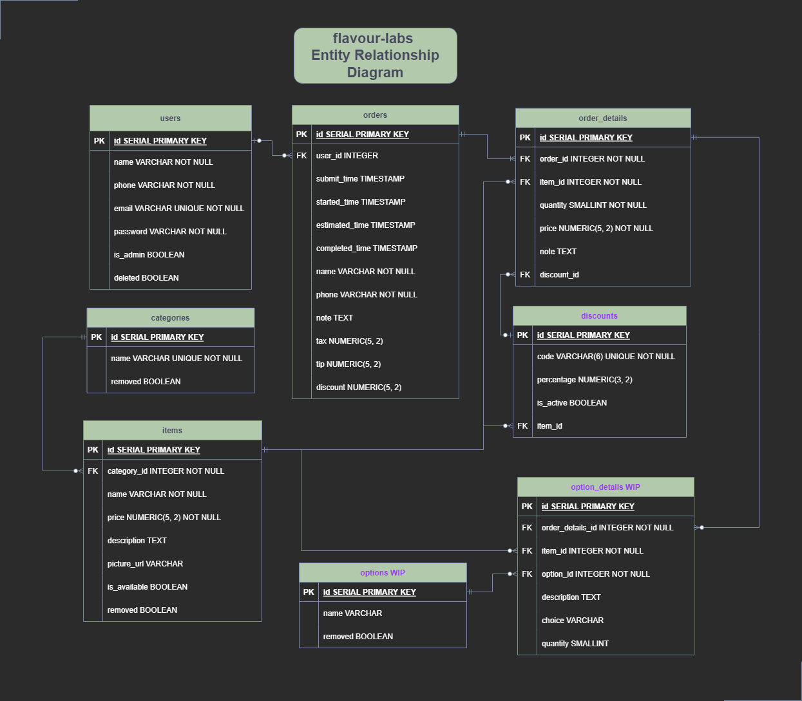

Flavour-Labs: A food ordering app.
=========
Collaborators: [Sylvielcq](https://github.com/sylvielcq), [anthonycampbell](https://github.com/anthonycampbell), [Sachieko](https://github.com/sachieko)

## Sample Images
Menu

Ordering

Restaurant View

## Flavour-Labs Entity Relationship Diagram

The following represents the structure of the relational database we will need for this app, including tables which are not implemented yet but may be implemented in the future. (These will not impact the functionality of our app if they are missing)

## Setup Info

- Use `npm i` to install all dependencies first
- You will also need to install the TWILIO API and have your own account, you can check up how ot setup TWILIO on their website.
- Use `npm run db:reset` to build the sample database.
- You can run the server using `npm run local` once your database is built up. You will have to configure a local .env file before running the server.

## Dependencies

- Node 10.x or above
- NPM 5.x or above
- PG 6.x
- bcryptjs
- Express
- Twilio API
- JQuery 3.0.8
- Sass

## Future Plans

- Use cookie-sessions to allow for encrypted logins
- Allow sign-ups
